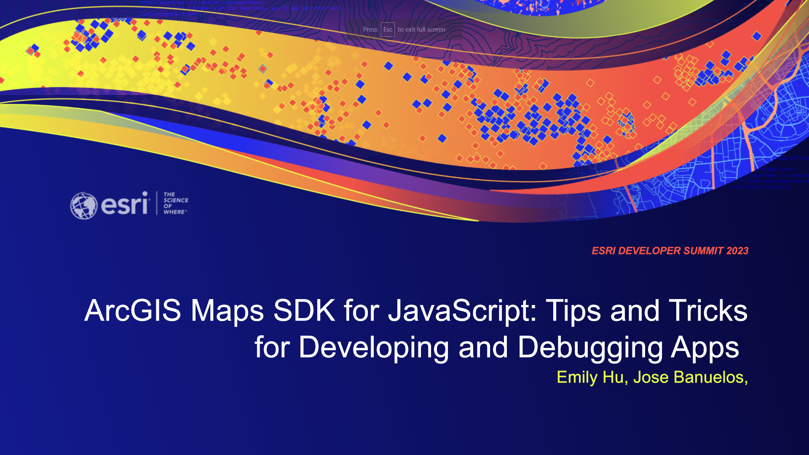

## ArcGIS Maps SDK for JavaScript: Tips and Tricks for Developing and Debugging Apps

Length: 30 min

Presenters: Emily Hu, Jose Banuelos

## Presentation

[Download Slides](https://github.com/banuelosj/DevSummit-presentation/blob/main/2022/web-editing-2d/slides/ds2022-arcgis-api-for-javascript-web-editing-2d.pptx?raw=true)

# Demo Live Links:

[Editor: LayerInfo C.R.U.D Improvements](https://banuelosj.github.io/DevSummit-presentation/2023/web-editing/demos/editor-layerinfo-demo)

